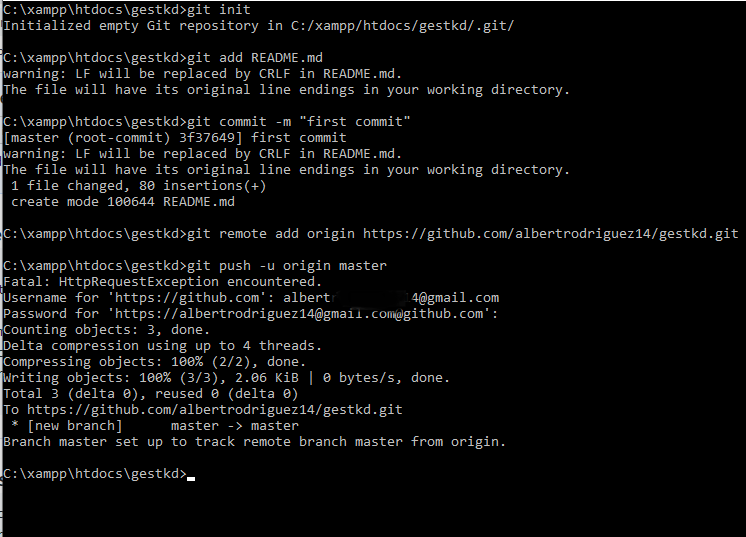

# sincronizar con github

 1  Crea un nuevo repositorio en github.com preferiblemente con el nombre  del proyecto que se encuentra de forma local.


2. abrimos la consola de comando **CMD** y nos ubicamos en la carpeta que se encuentra el proyecto 


3.seguimos la siguiente secuencia de comando **GIT.**

\*\*\*\*

```text
echo "# gestkd" >> README.md
git init
git add README.md
git commit -m "first commit"
git remote add origin https://github.com/albertrodriguez14/gestkd.git
git push -u origin master
```


\*\*\*\*




