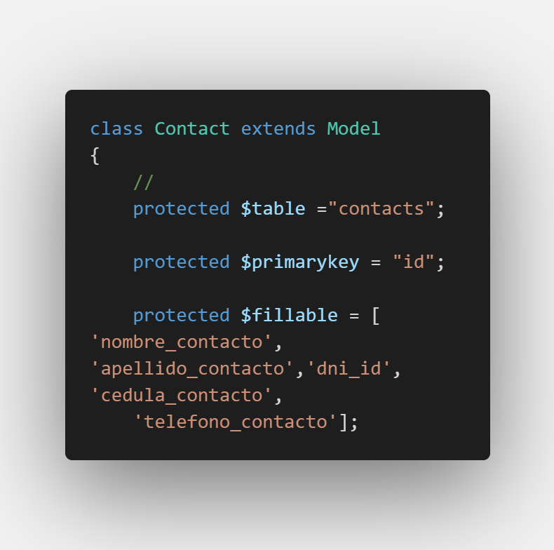

# Los Modelo

El ORM Eloquent incluido con Laravel proporciona una genial y simple implentación básica de ActiveRecord para trabajar con tu base de datos. Cada tabla de base de datos tiene un correspondiente "Modelo" el cual es usado para interactuar con la tabla. Los modelos permiten que consultes los datos en tus tablas, así como también insertar nuevos registros dentro de la tabla.

Antes de empezar, asegúrate de configurar una conexión de base de datos en `config/database.php`. Para mayor información sobre la configuración de tu base de datos, revisa la documentación.


### Definiendo modelos <a id="definiendo-modelos"></a>

Para empezar, vamos a crear un modelo de Eloquent. Los modelos residen típicamente en el directorio `app`, pero eres libre de colocarlos en cualquier parte que pueda ser auto-cargada de acuerdo a tu archivo `composer.json`. Todos los modelos de Eloquent extienden la clase `Illuminate\Database\Eloquent\Model`.

La forma más fácil de crear una instancia del modelo es usando el Comando Artisan `make:model`:

```text
php artisan make:model Flight
"se crea con la primera letra Mayuscula"
y asignarlo a una carpeta Models ejemplo:

php artisan make:model Models/Fligt/Flight
```

Si prefieres generar una migración de base de datos cuando generes el modelo, puedes usar la opción `--migration` o `-m`:

```text
php artisan make:model Flight --migration

php artisan make:model Flight -m
```


#### Convenciones del modelo Eloquent <a id="convenciones-del-modelo-eloquent"></a>

Ahora, vamos a mirar un modelo `Flight` de ejemplo, el cual usaremos para obtener y guardar información desde nuestra tabla de base de datos `flights`:

```text
<?php

namespace App;

use Illuminate\Database\Eloquent\Model;

class Flight extends Model
{
    //
}
```

**\#Nombres de tabla**

Observa que no le dijimos a Eloquent cuál tabla usar para nuestro modelo `Flight`. Por convención, el nombre de la clase en plural y en formato "snake\_case" será usado como el nombre de tabla a menos que otro nombre sea especificado expresamente. Así, en este caso, Eloquent asumirá que el modelo `Flight` guarde los registros en la tabla `flights`. Puedes especificar una tabla personalizada al definir una propiedad `table` en tu modelo:

```text
<?php

namespace App;

use Illuminate\Database\Eloquent\Model;

class Flight extends Model
{
    /**
    * The table associated with the model.
    *
    * @var string
    */
    protected $table = 'my_flights';
}
```


**Claves primarias**

Eloquent asumirá que cada tabla tiene una columna de clave primaria denominada `id`. Puedes definir una propiedad `$primaryKey` protegida para sobrescribir esta convención:

```text
<?php

namespace App;
use Illuminate\Database\Eloquent\Model;

class Flight extends Model
{
    /**
    * The primary key associated with the table.
    *
    * @var string
    */
    protected $primaryKey = 'flight_id';
}
```

Además, Eloquent asume que la clave primaria es un valor entero autoincremental, lo que significa que de forma predeterminada la clave primaria será convertida a un tipo `int` automáticamente. Si deseas usar una clave primaria que no sea de autoincremeneto o numérica debes establecer la propiedad pública `$incrementing` de tu modelo a `false`:

```text
<?php

class Flight extends Model
{
    /**
    * Indicates if the IDs are auto-incrementing.
    *
    * @var bool
    */
    public $incrementing = false;
}
```


**Marcas de tiempo o timestamps**

De forma predeterminada, Eloquent espera que las columnas `created_at` y `updated_at` existan en tus tablas. Si no deseas tener estas columnas manejadas automáticamente por Eloquent, establece la propiedad `$timestamps` de tu modelo a `false`:

```text
<?php

namespace App;

use Illuminate\Database\Eloquent\Model;

class Flight extends Model
{
    /**
    * Indicates if the model should be timestamped.
    *
    * @var bool
    */
    public $timestamps = false;
}
```


#### Asignación masiva <a id="asignacion-masiva"></a>

También puedes usar el método `create` para guardar un nuevo modelo en una sola línea. La instancia de modelo insertada te será devuelta por el método. Sin embargo, antes de hacer eso, necesitarás especificar o un atributo `fillable` o `guarded` del modelo, de modo que todos los modelos de Eloquent se protejan contra la asignación masiva de forma predeterminada.

Una vulnerabilidad en la asignación masiva ocurre cuando un usuario pasa un parámetro HTTP inesperado a través de una solicitud y ese parámetro cambia una columna en tu base de datos que no esperabas. Por ejemplo, un usuario malicioso podría enviar un parámetro `is_admin` a través de una solicitud HTTP, la cual es entonces pasada en el método `create` de tu modelo, permitiendo que el usuario se promueva a si mismo como un usuario administrador.

Así que, para empezar, debes definir cuáles atributos del modelo quieres que se asignen de forma masiva. Puedes hacerlo usando la propiedad `$fillable` del modelo. Por ejemplo, vamos a hacer el atributo `name` de nuestro modelo `Flight` sea asignado masivamente.

```text
<?php

namespace App;

use Illuminate\Database\Eloquent\Model;

class Flight extends Model
{
    /**
    * The attributes that are mass assignable.
    *
    * @var array
    */
    protected $fillable = ['name'];
}
```



