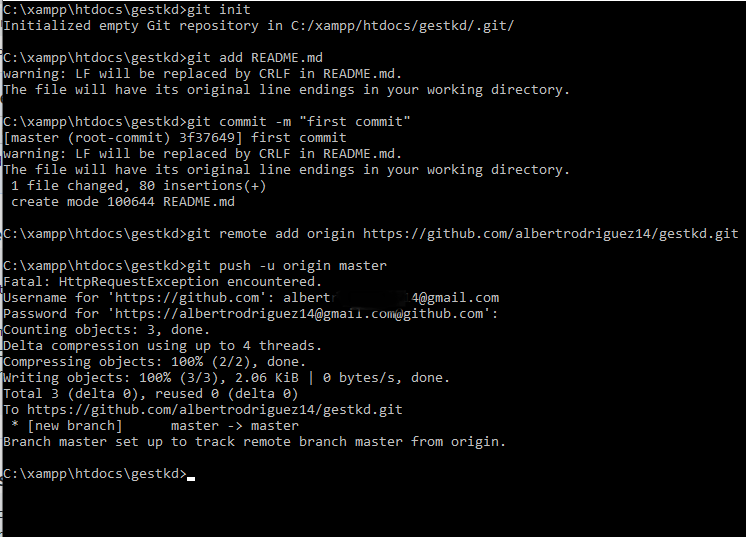

# Las Relaciones


### Definiendo relaciones <a id="definiendo-relaciones"></a>

Las relaciones de Eloquent se definen como métodos en tus clases de modelo de Eloquent. Debido a que, como los mismos modelos Eloquent, las relaciones también sirven como poderosos constructores de consultas, puesto que definir relaciones como métodos proporciona potentes capacidades de encadenamiento de métodos y consultas. Por ejemplo, podemos encadenar restricciones adicionales en esta relación `posts`:

```text
$user->posts()->where('active', 1)->get();
```


#### Uno A Uno <a id="uno-a-uno"></a>

Una relación de uno a uno es una relación muy sencilla. Por ejemplo, un modelo `User` podría estar asociado con un `Phone`. Para definir esta relación, colocaremos un método `phone` en el modelo `User`. El método `phone` debería llamar al método `hasOne` y devolver su resultado:

```text
<?php

namespace App;

use Illuminate\Database\Eloquent\Model;

class User extends Model
{
    /**
    * Get the phone record associated with the user.
    */
    public function phone()
    {
        return $this->hasOne('App\Phone');
    }
}
```

El primer argumento pasado al método `hasOne` es el nombre del modelo relacionado. Una vez que la relación es definida, podemos obtener el registro relacionado usando propiedades dinámicas de Eloquent. Las propiedades dinámicas permiten que accedas a métodos de relación como si fueran propiedades definidas en el modelo:


**Definiendo el inverso de la relación**

Así, podemos acceder al modelo `Phone` desde nuestro `User`. Ahora, vamos a definir una relación en el modelo `Phone` que nos permitirá accdeder al `User` que posee el teléfono. Podemos definir el inverso de una relación `hasOne` usando el método `belongsTo`:

```text
<?php

namespace App;

use Illuminate\Database\Eloquent\Model;

class Phone extends Model
{
    /**
    * Get the user that owns the phone.
    */
    public function user()
    {
        return $this->belongsTo('App\User');
    }
}
```

En el ejemplo anterior, Eloquent intentará hacer coincidir el `user_id` del modelo `Phone` con un `id` en el modelo `User`. Eloquent determina el nombre de la clave foránea de forma predeterminada al examinar el nombre del método de la relación y agregando el sufijo al nombre del método con `_id`. Sin embargo, si la clave foránea en el modelo `Phone` no es `user_id`, puedes pasar un nombre de clave personalizada como segundo argumento al método `belongsTo`:

```text
/**
* Get the user that owns the phone.
*/
public function user()
{
    return $this->belongsTo('App\User', 'foreign_key');
}
```

Si tu modelo padre no usa `id` como su clave primaria, o deseas hacer join al modelo hijo con una columna diferente, puedes pasar un tercer argumento al método `belongsTo` especificando la clave personalizada de tu tabla padre:

```text
/**
* Get the user that owns the phone.
*/
public function user()
{
    return $this->belongsTo('App\User', 'foreign_key', 'other_key');
}
```


#### Uno a muchos <a id="uno-a-muchos"></a>

Una relación de "uno-a-muchos" es usada para definir relaciones donde un solo modelo posee cualquier cantidad de otros modelos. Por ejemplo, un post de un blog puede tener un número infinito de comentarios. Al igual que todas las demás relaciones de Eloquent, las relaciones uno-a-muchos son definidas al colocar una función en tu modelo Eloquent:

```text
<?php

namespace App;

use Illuminate\Database\Eloquent\Model;

class Post extends Model
{
    /**
    * Get the comments for the blog post.
    */
    public function comments()
    {
        return $this->hasMany('App\Comment');
    }
}
```

Recuerda, Eloquent determinará automáticamente la columna de clave foránea apropiada en el modelo `Comment`. Por convención, Eloquent tomará el nombre "snake\_case" del modelo que la contiene y le agregará el sufijo `_id`. Para este ejemplo, Eloquent asumirá que la clave foránea del modelo `Comment` es `post_id`.

Una vez que la relación ha sido definida, podemos acceder a la colección de comentarios al acceder a la propiedad `comments`. Recuerda, ya que Eloquent proporciona "propiedades dinámicas", podemos acceder a los métodos de la relación como si fueran definidos como propiedades en el modelo:

```text
$comments = App\Post::find(1)->comments;

foreach ($comments as $comment) {
    //
}
```

Debido a que todas las relaciones también sirven como constructores de consultas \(query builders\), puedes agregar restricciones adicionales a cuyos comentarios sean obtenidos ejecutando el método `comments` y encadenando condiciones en la consulta:

```text
$comment = App\Post::find(1)->comments()->where('title', 'foo')->first();
```

**ejemplo :** 

tenemos el modelo que tendrá la llave primaria, el cual la otra tabla dependerá de esta llave principal 

 




la función hasMany indica que que la relación sera de uno a mucho y la otra sera la referencia inversa uno a mucho

